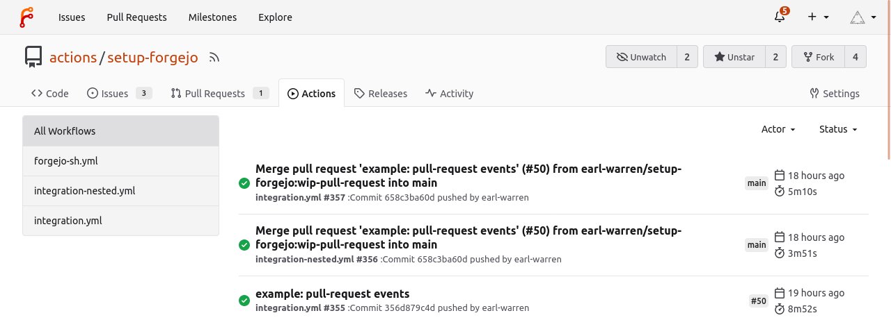
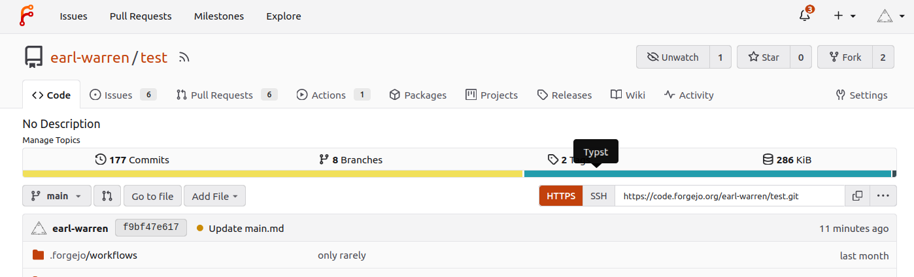

[Forgejo v1.21.1-0](/download/) is here and you will find the most interesting changes it introduces below. Before upgrading it is _strongly recommended_ to make a full backup as explained in the [upgrade guide](/docs/v1.21/admin/upgrade/) and carefully read _all breaking changes_ from the [release notes](https://codeberg.org/forgejo/forgejo/src/branch/forgejo/RELEASE-NOTES.md#1-21-1-0). If in doubt, do not hesitate to ask for help [on the Fediverse](https://floss.social/@forgejo), or in the [chat room](https://matrix.to/#/#forgejo-chat:matrix.org).

- **[Actions](/docs/v1.21/user/actions)**: server side, secrets can be managed via the API and the `pull_request_target` makes it possible to securely run workflows on pull requests, even when they need to access secrets. A major version of the Forgejo runner was [also published](https://code.forgejo.org/forgejo/runner/src/branch/main/RELEASE-NOTES.md#320) and it is now capable of [running actions on Docker, LXC or in a shell](/docs/v1.21/admin/actions/#labels-and-runs-on).

  

- **[Blocking a user](/docs/v1.21/user/blocking-user)**: repository transfers originating from the blocked user are canceled and the blocked user is removed from the list of collaborators on repositories owned by the user doing the blocking. This self-moderation feature introduced in v1.20 is most useful on large Forgejo instances and was since deployed on Codeberg. It has been used a few times by the Forgejo moderation team in cases that did not require admin privileges.

  

- **[Documentation](/docs/v1.21)**: new sections were added to the [developer guide](/docs/v1.21/developer/) such as the [user interface customization](/docs/v1.21/developer/customization/), which is considered an internal detail and requires intimate knowledge of the codebase to be maintained. Every new feature listed in the release notes was matched with an update in the documentation because it is intended to become an exhaustive reference. The [documentation repository](https://codeberg.org/forgejo/docs/) was split out of the website repository and restructured to facilitate the [maintenance and contribution workflow](https://codeberg.org/forgejo/docs/src/branch/next/README.md#contributing).

- **[Shortcut to create a PR](/docs/v1.21/user/pull-requests-and-git-flow/#create-a-pull-request):** a button is automatically shown if you recently pushed to branch and will open a PR with the default branch as a base.

  

- **New user mail notification**: When a Forgejo instance has open registration, it is occasionally subject to spam accounts. With the `SEND_NOTIFICATION_EMAIL_ON_NEW_USER = true` setting, the Forgejo admin will receive a mail when a new account is created and can immediately act on it, instead of discovering a dozen of spam bots a much later.

- **Additional syntax highlighting**: for [Smali](https://github.com/alecthomas/chroma/pull/765), [DHCP](https://github.com/alecthomas/chroma/pull/772), [WebGPU Shading Language](https://github.com/alecthomas/chroma/pull/776), [AutoHotkey](https://github.com/alecthomas/chroma/commit/4779f9035a3aaea3ec650f0923657c12e12dd35a), [AutoIt](https://github.com/alecthomas/chroma/commit/029798b351baa9c3d0dd5ec16e87ab98486d843c), [tal (uxntal)](https://github.com/alecthomas/chroma/commit/e422a6286fdc61393deb09afd270293eb590d023), [ArangoDB Query Language (AQL)](https://github.com/alecthomas/chroma/pull/794), [BIND DNS Zone](https://github.com/alecthomas/chroma/pull/796), [Odin](https://github.com/alecthomas/chroma/pull/802), [Sourcepawn](https://github.com/alecthomas/chroma/pull/804), [CPP](https://github.com/alecthomas/chroma/pull/813), [C](https://github.com/alecthomas/chroma/pull/815).

- **Additional language detection**: [Bluespec BH](https://github.com/atom-haskell/language-haskell), [D2](https://github.com/terrastruct/d2-vscode), [Go Workspace](https://github.com/golang/vscode-go), [Gradle Kotlin DSL](https://github.com/nishtahir/language-kotlin), [Hosts File](https://github.com/Alhadis/language-etc), [LOLCODE](https://github.com/KrazIvan/LOLCODE-grammar-vscode), [MDX](https://github.com/wooorm/markdown-tm-language), [Nasal](https://github.com/BobDotCom/Nasal.tmbundle), [Nushell](https://github.com/hustcer/nu-grammar), [Pact](https://github.com/kadena-io/pact-atom), [RBS](https://github.com/soutaro/vscode-rbs-syntax), [Rez](https://github.com/textmate/rez.tmbundle), [Sweave](https://github.com/textmate/sweave.tmbundle), [TL-Verilog](https://github.com/adamint/tlv-vscode), [Typst](https://github.com/michidk/typst-grammar), [WDL](https://github.com/broadinstitute/wdl-sublime-syntax-highlighter), [WGSL](https://github.com/wgsl-analyzer/wgsl-analyzer), [WebAssembly Interface Type](https://github.com/bytecodealliance/vscode-wit)

  

Read more [in the Forgejo v1.21.1-0 release notes](https://codeberg.org/forgejo/forgejo/src/branch/forgejo/RELEASE-NOTES.md#1-21-1-0).

### Forgejo Actions

Forgejo is only as stable and robust as the test infrastructure that verifies it works. Forgejo Actions is not just a feature, it is an integral part of what makes Forgejo whole. With v1.21 this self-sustainable ecosystem grew with more components such as [end to end testing](https://code.forgejo.org/forgejo/end-to-end) and upgrade tests running older versions of Forgejo. Each repository is independent but it is not isolated from the others. Developers do not need to manually keep them in sync, they are [bound together with tests](https://code.forgejo.org/actions/cascading-pr/#forgejo-dependencies). As more components are added, these tests will be the cement keeping them together, allowing developers to focus on what matters.

Server side the most notable improvements are:

- The [`pull_request_target` event](/docs/v1.21/user/actions/#onpull_request_target) is implemented and can securely access secrets because it runs using the workflows from the base branch instead of the pull request.
- The API can now be used to manage secrets for [users](https://code.forgejo.org/api/swagger/#/user/updateUserSecret), [organizations](https://code.forgejo.org/api/swagger/#/organization/orgListActionsSecrets) and [repositories](https://code.forgejo.org/api/swagger/#/repository/updateRepoSecret).
- Registration tokens can [register multiple runners](/docs/v1.21/admin/actions/#registration) instead of a single one.
- [Variables can be used in addition to secrets](/docs/v1.21/user/actions/#variables) to configure workflows when there is no need for secrecy.
- [Recurring actions similar to cron jobs](/docs/v1.21/user/actions/#onschedule) can be defined in the main branch.
- [Uploaded artifacts can be automatically cleaned up](/docs/v1.21/user/actions/#artifacts).
- When a new commit is pushed to a branch, the workflows triggered by previous commits are [automatically canceled](/docs/v1.21/user/actions/#auto-cancelation-of-workflows).
- It is now possible to [upload multiple artifacts](/docs/v1.21/user/actions/#artifacts) instead of a single one.
- The labels can be communicated to Forgejo from the runner when they connect [instead of just during registration](/docs/v1.21/admin/actions/#registration).

[Forgejo Actions](/docs/v1.21/user/actions) is however **not yet production ready**, for the reasons explained in the [Forgejo v1.20](/2023-07-release-v1201-0/#forgejo-actions) blog post.

Client side, the newer version of the [Forgejo runner](https://code.forgejo.org/forgejo/runner/src/branch/main/RELEASE-NOTES.md#320) that is responsible for running the workflows now comes in two flavors:

- [binary release](https://code.forgejo.org/forgejo/runner/releases/tag/v3.2.0)
- [container image](https://code.forgejo.org/forgejo/-/packages/container/runner/3.2.0)

It is [tested](https://code.forgejo.org/forgejo/end-to-end) with itself to verify
a new version does not introduce a trivial regression that would break Forgejo, using an [action to cascade
pull requests between repositories](https://code.forgejo.org/actions/cascading-pr/).

Read more about Forgejo actions [in the user guide](/docs/v1.21/user/actions/) and [in the administrator guide](/docs/v1.21/admin/actions/).

### What is unique to Forgejo?

Until recently all Forgejo commits could have been merged into Gitea
overnight. But as of October 2023 Gitea [requires a copyright
assignment](https://codeberg.org/forgejo/discussions/issues/67) in addition to the MIT license. It
means that the most significant contributions such as
[blocking a user](/docs/v1.21/user/blocking-user) will not be merged into Gitea
and are unique to Forgejo v1.21 and later.

Forgejo continues to include all of Gitea and guarantees a 100%
drop-in replacement for Gitea admins. No action is required, it is
enough to replace the Gitea binary or the container image with the
equivalent Forgejo release and restart.

Such an upgrade may be motivated to benefit from security
fixes that only exist in Forgejo, such as the
[Long-term authentication](/2023-10-release-v1-20-5-0/#long-term-authentication-token)
vulnerability which is fixed since Forgejo v1.20.5-0 and will also be in Gitea v1.22 early 2024.

### Federation

Does `Forgejo` support federation? Not yet. Was there progress? Yes.

The monthly reports [have details](/tag/report/) on
these progress and the [State of the Forge Federation: 2023
edition](https://forgefriends.org/blog/2023/06/21/2023-06-state-forge-federation/)
published in June 2023 explains how Forgejo fits in the big picture.

Forges have existed for over twenty years and none of them has achieved
data portability let alone federation. Forgejo is yet to celebrate the publication of
its first release and it will take it a little time to get there.

### Get Forgejo v1.21

See the [download page](/download)
for instructions on how to install Forgejo, and read the
[release notes](https://codeberg.org/forgejo/forgejo/src/branch/forgejo/RELEASE-NOTES.md#1-21-1-0)
for more information.

### Upgrading

Carefully read
[the breaking changes](https://codeberg.org/forgejo/forgejo/src/branch/forgejo/RELEASE-NOTES.md#1-21-1-0)
section of the release notes.

The actual upgrade process is as simple as replacing the binary or container image
with the corresponding [Forgejo binary](https://codeberg.org/forgejo/forgejo/releases/tag/v1.21.1-0)
or [container image](https://codeberg.org/forgejo/-/packages/container/forgejo/1.21.1-0).
If you're using the container images, you can use the
[`1.21` tag](https://codeberg.org/forgejo/-/packages/container/forgejo/1.21)
to stay up to date with the latest `1.21.x` point release automatically.

Make sure to check the [Forgejo upgrade
documentation](/docs/v1.21/admin/upgrade) for
recommendations on how to properly backup your instance before the
upgrade. It also covers upgrading from Gitea, as far back as version 1.2.0.
Forgejo includes all of Gitea v1.21.

### Contribute to Forgejo

If you have any feedback or suggestions for Forgejo do not hold back, it is also your project.
Open an issue in [the issue tracker](https://codeberg.org/forgejo/forgejo/issues)
for feature requests or bug reports, reach out [on the Fediverse](https://floss.social/@forgejo),
or drop into [the Matrix space](https://matrix.to/#/#forgejo:matrix.org)
([main chat room](https://matrix.to/#/#forgejo-chat:matrix.org)) and say hi!
